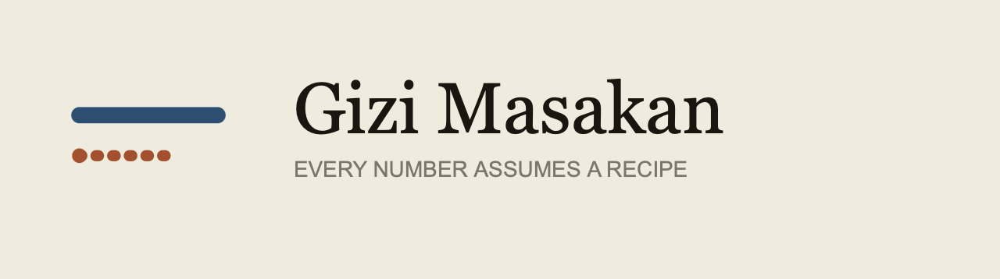

<div align="center">

<picture>
  <source media="(prefers-color-scheme: dark)" srcset="docs/lockup-dark.png">
  
</picture>

**Gizi masakan Indonesia, dengan resep yang diasumsikan ditampilkan di bawahnya — karena tidak ada satu nasi padang yang benar.**

[**Buka situsnya →**](https://andifathulms.github.io/gizi-masakan/)

[](https://github.com/andifathulms/gizi-masakan/actions/workflows/deploy.yml)


</div>

---

Ketik sebuah masakan, lihat angkanya, dan **tepat di bawahnya** lihat daftar
bahan dan berat gram yang menghasilkan angka itu. Ubah santannya dari 50 g jadi
100 g dan semuanya bergerak. Ganti cara masaknya dari digoreng jadi direbus dan
angkanya ikut pindah.

Bukan karena itu fitur canggih — tapi karena **begitulah alat ini berkata jujur.**
Selisih antara gado-gado dua warung lebih besar daripada ketelitian yang bisa
diklaim aplikasi mana pun, jadi asumsinya ditampilkan, bukan disembunyikan.

Ini alat rujukan, **bukan pelacak**. Tidak ada total harian, jatah kalori,
rentetan hari, atau pencatatan. Lihat [PRD §5](PRD.md).

## Satu angka, dari awal sampai akhir

Setiap angka di situs ini adalah satu rumus, dijalankan sekali per bahan:

```
Sumbangan = berat ÷ 100 × nilai per 100 g × faktor retensi
```

Halaman masakan menampilkan rumus itu di atas tabelnya, lalu tiap barisnya:
berapa gram, nilai per 100 g mana, faktor retensi apa dan kutipannya, dan
nomor FDC bahannya. Faktor **yield** punya kolom sendiri di luar rumus itu,
karena yield mengubah berat dan bukan gizi — beras hampir tiga kali lipat
beratnya waktu ditanak, dan kalorinya tidak ikut naik.

## Yang sudah jalan

| | |
|---|---|
| Masakan | **40 resep** — nasi, mi, berkuah, lauk, sayur, jajanan, minuman |
| Bahan | 70 entri USDA FoodData Central SR Legacy, dipetakan ke nama dapur Indonesia |
| Nutrien | 27, dengan nomor nutrien FDC sebagai id |
| Faktor | Retensi USDA Release 6 (270 operasi), yield USDA (54 baris) + 9 turunan |
| Cara masak | 17 kelompok, 73 operasi — bisa diganti, angkanya ikut berubah |
| AKG | Permenkes 28/2019, 19 kelompok umur dan jenis kelamin |
| Uji | **282** — konservasi, kekosongan, retensi, determinisme, URL, pencarian, transkripsi AKG |
| Data terkirim | 32 KB dari anggaran 200 KB |

Semua yang bisa diubah pembaca tersimpan di URL, jadi hasilnya bertahan setelah
halaman dimuat ulang dan bisa dikirim ke orang lain. Versi resep Anda sendiri
bisa disimpan ke perangkat — tidak ada yang keluar dari peramban.

## Yang belum jalan, dan disebut apa adanya

- **Berat bahan di 40 resep belum ditimbang.** Semua ditandai `perkiraan` dan
  tampil berwarna terakota. Menimbangnya adalah bagian proyek ini yang tidak
  bisa diotomatiskan, dan itu belum dikerjakan. Ini pekerjaan paling berharga
  yang tersisa.
- **Tabel URT masih kosong.** Invarian 9 melarang entri yang tidak diukur, jadi
  porsi ditampilkan dalam gram sampai ada yang benar-benar ditimbang.
- **13 bahan Indonesia belum punya sumber** — kangkung, lengkuas, kemiri, serai,
  terasi, gula merah, kecap manis, dan lainnya. Bahan itu tetap ada di resep dan
  disebut sebagai kekosongan di keluaran, bukan dihapus atau didekati. Dua di
  antaranya cukup besar sampai menggeser satu masakan penuh: `gula-merah`
  membuat wedang jahe jadi 16 kkal segelas, dan `kecap-manis` mengosongkan gula
  dari empat masakan yang justru dinamai dari kecapnya.

## Yang paling penting dari semuanya

**Tidak ada nilai yang hilang diam-diam.** Bahan tanpa data, nilai gizi yang
kosong, faktor yang tidak ada — semuanya jadi entri di `trace.gaps` dan muncul di
layar. Tidak pernah diganti nol, tidak pernah barisnya dihapus, tidak pernah
diambilkan dari bahan yang mirip.

Alasannya: kegagalan paling berbahaya di kalkulator gizi bukan galat, tapi angka
yang tetap terlihat masuk akal. Sebuah bahan yang dihilangkan diam-diam
menyisakan total yang kelihatan benar dan kurang persis sebanyak yang tak
terlihat siapa pun.

## Perintah

```bash
pnpm dev
pnpm build                  # data:validate, next build, lalu .nojekyll
pnpm preview                # sajikan ./out di bawah basePath produksi

pnpm test:run               # 282 uji
pnpm test:conservation      # jumlah sumbangan, keseimbangan massa
pnpm test:gaps              # penanganan nilai kosong, dua arah
pnpm test:state             # URL, resep tersimpan, pencarian
pnpm data:validate          # gerbang lisensi, id FDC, kutipan, rujukan resep
pnpm typecheck && pnpm lint

# hanya untuk pengembangan dan CI terjadwal — tidak pernah bagian dari pnpm build
pnpm fdc:fetch && pnpm fdc:build
pnpm factors:fetch && pnpm factors:build   # perlu poppler-utils
```

## Sumber dan lisensi

| Sumber | Lisensi | Status |
|---|---|---|
| USDA FoodData Central SR Legacy | Karya Pemerintah AS — domain publik | dipakai |
| USDA Table of Nutrient Retention Factors, Release 6 | domain publik | dipakai |
| USDA Table of Cooking Yields for Meat and Poultry | domain publik | dipakai |
| Permenkes RI No. 28 Tahun 2019 (AKG) | peraturan perundang-undangan, UU 28/2014 Pasal 42 | dipakai |
| Tabel URT | pengukuran sendiri | dipakai (masih kosong) |
| Resep | susunan sendiri | dipakai |
| **TKPI (Kemenkes)** | **all rights reserved** | **dikecualikan** |

**TKPI tidak dipakai dan tidak boleh dipakai.** Itu buku berhak cipta, bukan
peraturan perundang-undangan, sehingga di luar pengecualian UU 28/2014 Pasal 42.
Adapternya ada di `lib/sources/tkpi`, tidak memuat satu pun nilai TKPI, dan
memanggil gerbang lisensi lebih dulu — jadi selalu menolak. `pnpm data:validate`
gagal kalau entri TKPI dihapus dari manifes, kalau statusnya diubah, atau kalau
ada jalan pintas yang melewati gerbangnya.

## Struktur

```
lib/nutrition/    inti. murni, deterministik, jalan di Node
  compute.ts      (resep, tabel, faktor) → NutritionTrace
  gaps.ts         deteksi dan penamaan kekosongan — ditulis lebih dulu, bukan belakangan
  retention.ts    dua keadaan saja: disesuaikan-dengan-kutipan, atau tanpa penyesuaian
  pengolahan.ts   cara masak alternatif, dari tabel USDA yang sama
lib/sources/      adapter. fdc aktif, tkpi mati di balik gerbang lisensi
lib/url/          keadaan tampilan ⇄ query string. murni, plus satu hook
lib/simpan/       resep tersimpan di perangkat. murni, plus satu hook
data/             semua data terkirim, tiap nilai berkutipan dan bertanggal
scripts/          pipeline hanya-pengembangan, dan validator
tests/            konservasi ditegaskan di setiap uji di setiap berkas
```

Baca [`PRD.md`](PRD.md) untuk lingkupnya dan [`CLAUDE.md`](CLAUDE.md) untuk cara
bekerja di repo ini.

## Penempatan

`main` dibangun dan dipasang lewat GitHub Actions. `basePath` harus sama dengan
nama repositorinya; `.nojekyll` wajib ada di `out/`. Periksa dengan
`pnpm preview` sebelum push.

Aset merek ada di `exports/` dan **tidak ikut di-commit** — itu kit sumber,
bukan masukan build. Yang benar-benar disajikan situs ada di `public/`.

---

<div align="center">

Proyek pribadi. Nilai bahan adalah pendekatan dari basis data Amerika untuk bahan
Indonesia. Angka masakan adalah perkiraan dari resep yang ditampilkan.
**Bukan nasihat medis atau nasihat gizi.**

</div>
